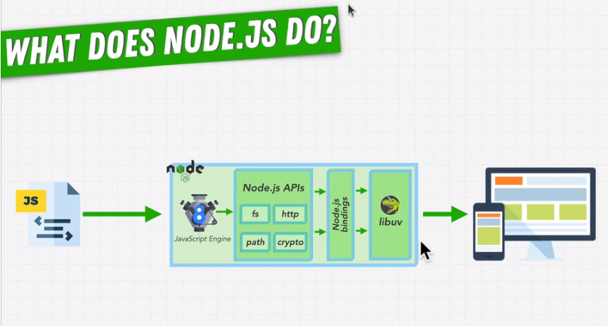

# 03 - NodeJS Fundamentals: Internals

## 3.1 - Nodejs runtime and its internals

- Nodejs can run plain-convential js using V8, but it's not only limited to that.
- It can also do much more, which are out of scope for plain-conventional js. Things like making an http request and getting a response, reading from and writing to a file or database, etc. All these tasks require an extra layer of processing that isn't part of js, but somthing more.
- Hence, nodejs APIs come into play. APIs like http, fs, path and the like.
- A few of them have been written in js. But sometimes, to use those extra capabilities such as interacting with OS, cannot be done with plain js. Hence, we use nodejs "bindings" that are sort of a bridge between javascript and lower-level languages like C/C++ that can implement those functionalities.
- The actual implementation of such APIs lives inside "libuv", which is a library that lets nodejs perform async executions and make it very powerful.

- Runtime diagram:

  

## 3.2 - Async vs Sync Programming

- This part of lecture included basic difference between sync and async programming with code examples. Somthing, that I already know.

## 3.3 - Is javascript sync or async

- Js is a synchronous programming language.
- Core js runs code sequentially - line by line, only going to the next one, when the last one finishes.
- But smart people have manipulated js to provide it the capabilities to run async operations in certain environments (such as browser and nodejs). Hence, this line is often said about js:

      Javascript is a synchronous, single-threaded, non-blocking programming language.

  - Synchronous: the code written inside js is executed line by line, in a sequential manner. One line finishes, then only the next line runs.
  - Single-threaded: JS is designed to use only one thread, and hence executed in only one sequence of instructions. It cannot run concurrent, side-by-side sequences of instructions on mutiple-threads.
  - Non-blocking: js is synchronous but it can also run async code which do not block the control and the program can continue executing.

## 3.4 - Is Node.js multi-threaded?

- What are threads?
  - "threads" represent the smallest unit of execution withing a process (processes have mutiple threads). They are a sequence of instructions that can be scheduled for execution.
