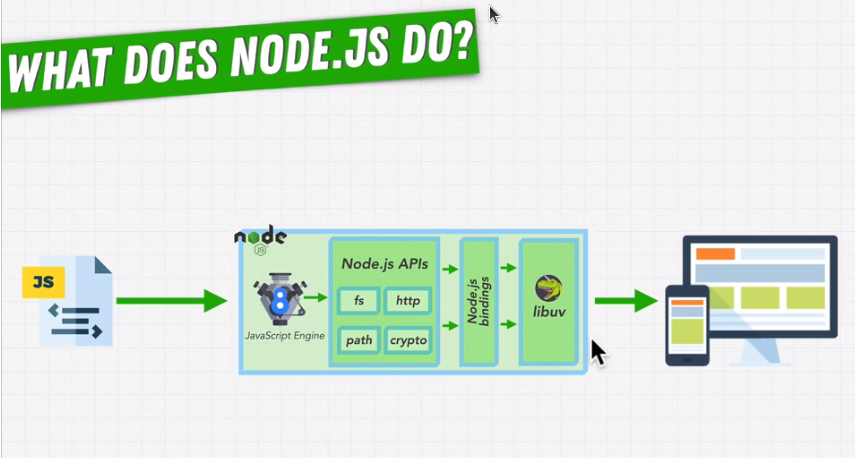
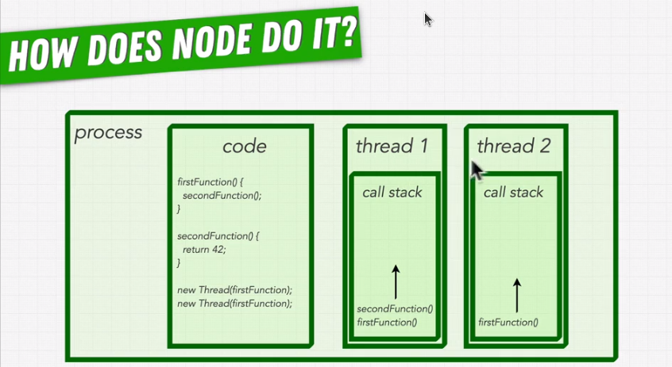
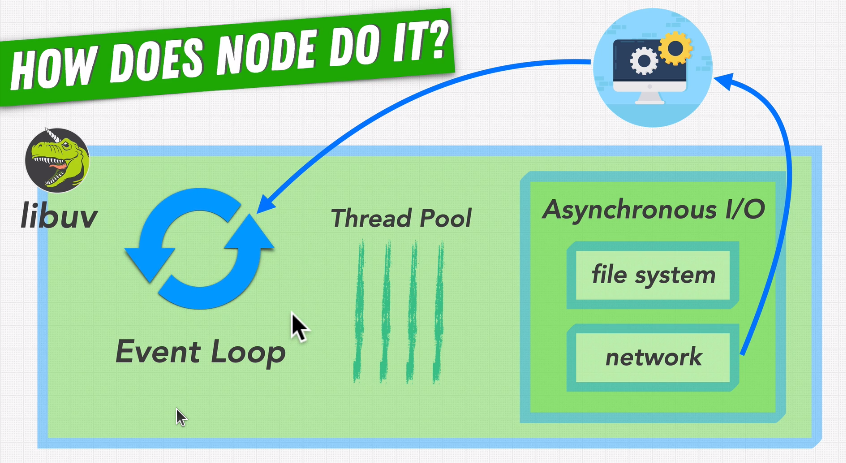
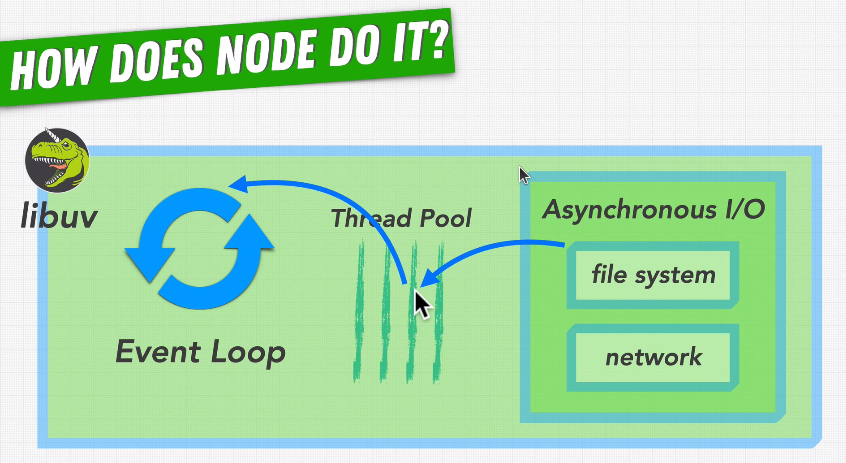
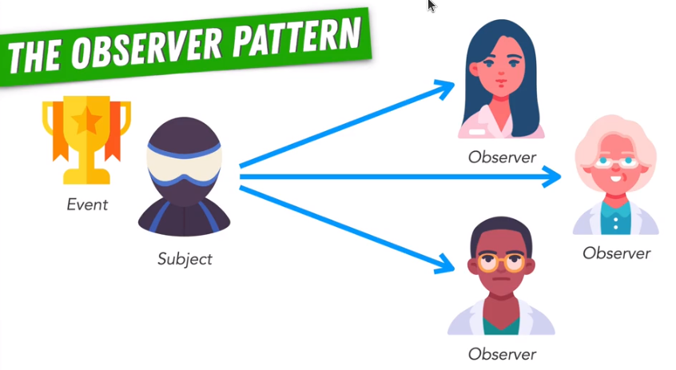

# 03 - NodeJS Fundamentals: Internals

## 3.1 - Nodejs runtime and its internals

- Nodejs can run plain-convential js using V8, but it's not only limited to that.
- It can also do much more, which are out of scope for plain-conventional js. Things like making an http request and getting a response, reading from and writing to a file or database, etc. All these tasks require an extra layer of processing that isn't part of js, but somthing more.
- Hence, nodejs APIs come into play. APIs like http, fs, path and the like.
- A few of them have been written in js. But sometimes, to use those extra capabilities such as interacting with OS, cannot be done with plain js. Hence, we use nodejs "bindings" that are sort of a bridge between javascript and lower-level languages like C/C++ that can implement those functionalities.
- The actual implementation of such APIs lives inside "libuv", which is a library that lets nodejs perform async executions and make it very powerful.

- Runtime diagram:

  

## 3.2 - Async vs Sync Programming

- This part of lecture included basic difference between sync and async programming with code examples. Somthing, that I already know.

## 3.3 - Is javascript sync or async

- Js is a synchronous programming language.
- Core js runs code sequentially - line by line, only going to the next one, when the last one finishes.
- But smart people have manipulated js to provide it the capabilities to run async operations in certain environments (such as browser and nodejs). Hence, this line is often said about js:

      Javascript is a synchronous, single-threaded, non-blocking programming language.

  - Synchronous: the code written inside js is executed line by line, in a sequential manner. One line finishes, then only the next line runs.
  - Single-threaded: JS is designed to use only one thread, and hence executed in only one sequence of instructions. It cannot run concurrent, side-by-side sequences of instructions on mutiple-threads.
  - Non-blocking: js is synchronous but it can also run async code which do not block the control and the program can continue executing.

## 3.4 - Is Node.js multi-threaded?

- What are threads?

  - "Threads" represent the smallest unit of execution withing a process (processes have mutiple threads). They are a sequence of instructions (such as function calls) that can be scheduled for execution.
  - Each thread has its own call stack.
  - Mutiple threads in the same process run asynchronously. All the threads in the same process can share the same memory of the process but not call stacks.
  - Each core can be dedicated to execute a single thread.

    

- Nodejs is a JS runtime so it has to align with how the plain JS is and works (highlighting the single-threaded nature of js). But Nodejs has mechanisms inside that also run async operations.
- Inside a Nodejs process, there is only "one main thread", which runs the JS code and also "libuv"
- "Libuv" has something that is called as "Event loop", that handles all the async operations that are written in the JS code.

  - Libuv majorily handles two types of async operations: file system related and network related.
  - Whenver the code written in JS encouters an async call, it pushes it to the event loop and then the event loop decides how and where to delegate this async operation to be executed.
  - Network calls are delegated to the OS.

    

  - File system operations are done inside "Thread pool", which is a collection of "four default threads" (excluding the main thread), whose sole purpose is to execute async operations inside a process.

    

## 3.5 Callback queues and Event loop

- Callback queues

  - All the async operations are handled by the event loop. Whenever, each operation finishes, the respective callback for that async operation is made ready to execute. Further async operations when finished, their callbacks also align one after the other in a queue.
  - This is known as the "callback queue." All of the callbacks inside the callback queue are executed once the control is done executing all the sync code in that process.
  - Aka: "event queue", "message queue"

- Event loop

  - It's a piece of code or a mechanism inside Nodejs that allows to execute async code.
  - "Event-driven" architecture:
    - "event-driven" is a programming paradigm in which the flow of the program is determined by the events such as user actions, sensor outputs or messages from other program.
    - Nodejs is defined as an "event-driven" JS runtime.
    - In the context of nodejs, event-driven means that much of the nodejs functionality is build to handle events like incoming network requests, file systems operations or any other async operations.

## 3.6 - Observer Pattern

- It is a design pattern in which an object, known as "Subject", maintains a list of dependents, known as "Observers" and when there is a change in subject's state, all observers are notified and can react to that change/event.

- This design pattern allows a one-to-many dependency between objects.

  

- In the context of Nodejs, observer pattern is leveraged inside the event-driven architecture.
  - Subject: The event emitter acts as the subject (created using EventEmitter class from "events" module of Nodejs).
  - Observers: All the functions (callbacks) that are registered to listen to specific event of the subject act as the observers. Once the asyn operation/event runs, the oberservers are notified and executed.
